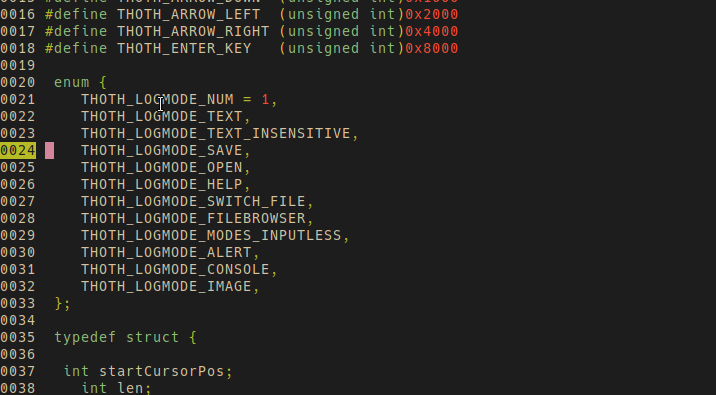
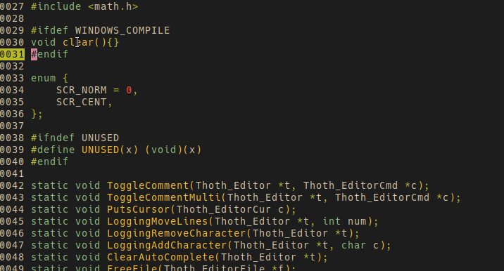
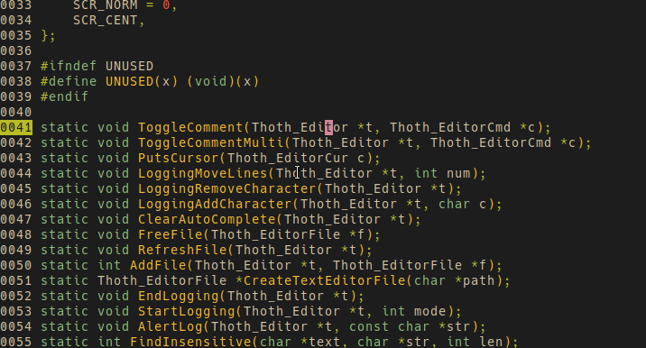
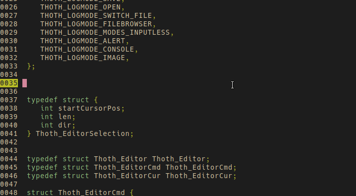
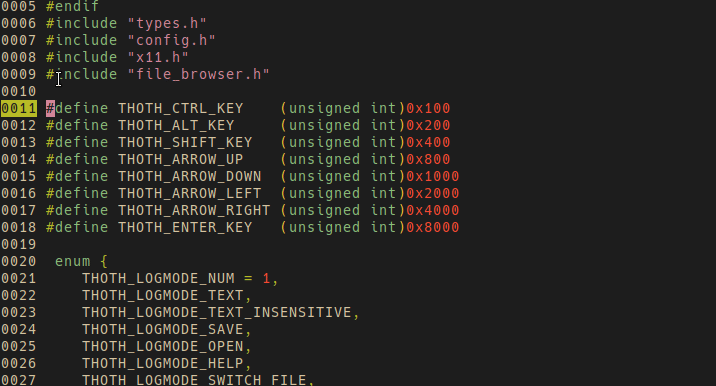

https://zimedit.lovable.app/
 
https://rotatedev.itch.io/zim BINARIES 
New <b>colorscheme</b> is: https://github.com/morhetz/gruvbox 
<b>font</b>: https://github.com/larsenwork/monoid 

 
	 
  

	 
  

	 

	 
	 
	 
 
  
<b>TODO</b>: 
bug selectnextword, resolvecursorcollision makes the selection double for matched right after.

copy/paste bugs 
convert spaces to tabs, macro.  
Have only the active file in memory AND swap files 
minimap 
highlighting for more languages than C, and general lua (function is a keyword) 
check for file change outside editor and reload on window focus event 
code folding 
 
 
Example zimconfig.cfg</b> 
# gruvbox  
COLOR_CYAN 0x8e 0xc0 0x7c 
COLOR_RED 0xfb 0x49 0x34 
COLOR_YELLOW 0xfa 0xbd 0x2f 
COLOR_BLUE 0x83 0xa5 0x98 
COLOR_GREEN 0xb8 0xbb 0x26 
COLOR_MAGENTA 0xd3 0x86 0x9b 
COLOR_WHITE 0xeb 0xdb 0xb2 
COLOR_BLACK 0x28 0x28 0x28 
COLOR_GREY 0x92 0x83 0x74 
COLOR_BG 0x28 0x28 0x28  
<b>COMMANDS</b>: 
ctrl+a (select all) 
ctrl+- (zoom out) 
ctrl+= (zoom in) 
ctrl+q (quit) 
escape (closes find/goto/console, removes extra cursors/selections) 
ctrl+b (compile (runs "make")) 
ctrl+y (redo) 
ctrl+z (undo) 
ctrl+x (cut) 
ctrl+c (copy) 
ctrl+v (paste) 
arrow keys (movement) 
ctrl+h (move left) ctrl+l (move right) ctrl+j (move up) ctrl+k (move down) 
shift+arrow up/down (scroll screen up/down) 
ctrl+alt+arrow right/left (expand selection by words right/left) 
ctrl+alt+[ (indent backward)  
ctrl+alt+] (indent forward)  
ctrl+alt+h (move by words left) ctrl+alt+l (move by words right) 
ctrl+shift+l (expand selection by a line) 
ctrl+shift+k (delete line) 
ctrl+arrow up (add cursor up) 
ctrl+arrow down (add cursor down) 
ctrl+d (select word under cursor if no selection. continued pressing selects the next occurance of word or selection) 
ctrl+g (goto line) 
ctrl+f (search) (enter to search forward, ctrl+enter to search backward) 
ctrl+F (case senstive search) 
ctrl+m (move brackets) (moves cursor between the { }, ( ), [ ], of the current scope) (either to the end, or to the beginning if its at the end) 
ctrl+shift+j (select brackets) (selects everything between the brackets) 
ctrl+/ (toggle comment) (adds or removes // for the line to comment) (todo: mutli-line) 
ctrl+shift+arrow up/down (move line up/down) (moves the entire line the cursors on, or every line in the selection by a line) 
ctrl+o (open file) 
ctrl+shift+o (file browser) 
ctrl+s (save file) 
ctrl+shift+s Save As file 
ctrl+n New file  
ctrl+p Switch file, (lists open files) 
ctrl+w Close file 

 
Deveoloped while bedridden after I got hit by a car on a moped. 
